개발 시작부터 커밋, 푸시까지
============================

여기서는 기능 개발을 위한 소스 코드 복제부터 커밋, 서버로 푸시하고 합치는 과정에 대해 다룹니다.

목차
----

1. 소스 코드 복제
2. 각 브랜치에 대한 설명
3. 소스 코드 업데이트
4. 소스 코드 커밋 및 푸시
5. Merge Request 생성
6. Maven이 라이브러리를 불러오지 못할 때

1\. 소스 코드 복제
-----------------

이 프로젝트의 레포지토리 정보는 다음과 같다.

| 이름     | 값                                               |
| -------- |--------------------------------------------------|
| URL      | http://192.168.1.213:1680/jnvalue/jnportal-n.git |
| User     | 그룹웨어 ID와 동일                               |
| Password | Gitlab 비밀번호. 기본값은 `jnvjnv0701`           |

프로젝트를 내려받기 위해 다음 방법을 사용할 수 있다.

* Eclipse의 EGit 플러그인 사용
* git 명령어 사용

이 중 Eclipse를 사용하지 않는 방법은 git 명령줄 클라이언트(https://git-scm.com/)를 다운로드해야 한다.

### Eclipse를 사용하는 방법

1. 우선 Eclipse 창 우상단의 Perspective 툴바에서  버튼을 클릭한다.
2. `Open Perspective` 창에서 `Git`을 더블 클릭한다.  
   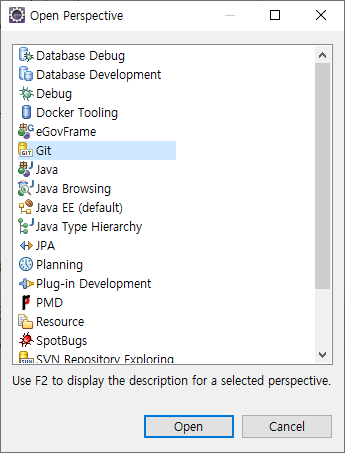
3. Perspective 툴바에서 을 선택하여 Git Perspective로 전환한다.
4. 화면 좌측 `Git Repositories` 창 빈 공간의 컨텍스트 메뉴, 또는 툴바의  버튼을 클릭한다.  
   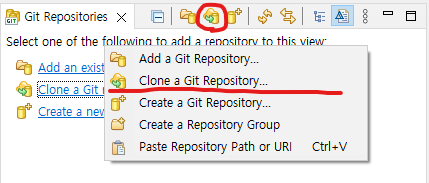
5. `Clone Git Repository` 대화상자에서 레포지토리 정보를 입력한 후 `Next` 버튼을 클릭한다.  
   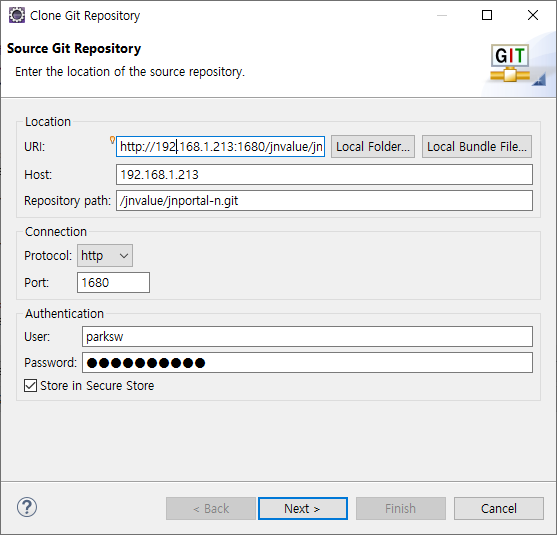
6. `develop`, `main` 브랜치를 선택하여 `Next` 버튼을 클릭한다.  
   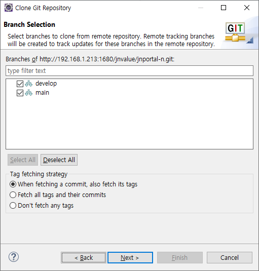
7. 경로를 수정하고 `Finish` 버튼을 클릭하여 프로젝트를 복제한다.  
   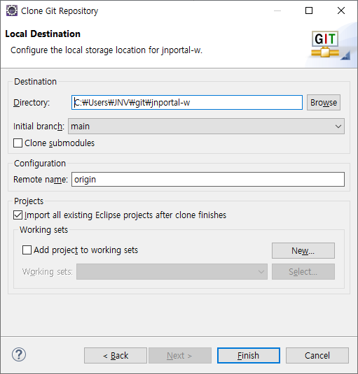
8. 소스 코드 복제가 완료되면, `Git Repositories` 창에서 프로젝트의 `Working Tree` 항목을 마우스 오른쪽 클릭하고,
   `Import Projects...` 항목을 클릭한다.  
   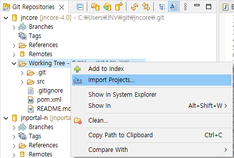
9. `Import Projects from File System or Archive` 창에서 프로젝트를 선택한 후 `Finish` 버튼을 클릭한다.
   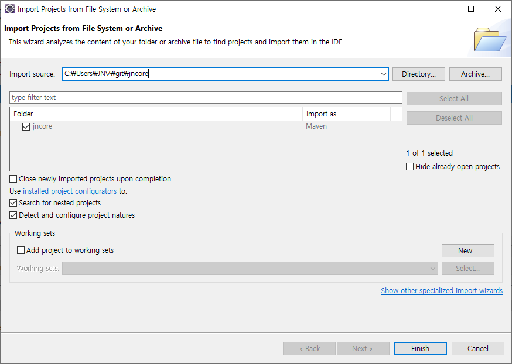

### 명령줄을 사용하는 방법

1. 명령줄(e.g. cmd, bash, pwsh)을 실행한다.
2. 소스 코드를 복제할 경로로 이동한다.
   ```shell
   cd 작업영역_폴더
   ```
3. `git clone` 명령어를 실행하여 프로젝트를 복제한다.
   ```shell
   git clone http://192.168.1.213:1680/jnvalue/jnportal-n.git
   ```
4. 복제한 프로젝트 폴더로 이동한다.
   ```shell
   cd jnportal-n
   ```
5. 커밋 시 사용할 사용자명과 이메일 주소를 설정한다.
   ```shell
   git config --global user.name 이름
   git config --global user.email 이메일_주소
   ```
6. 복제한 프로젝트는 Eclipse의 `File`-`Import...` 메뉴를 선택하면 나오는 대화상자에서
   `Maven`-`Existing Maven Projects`를 선택하여 불러올 수 있다.

2\. 각 브랜치에 대한 설명
-------------------------

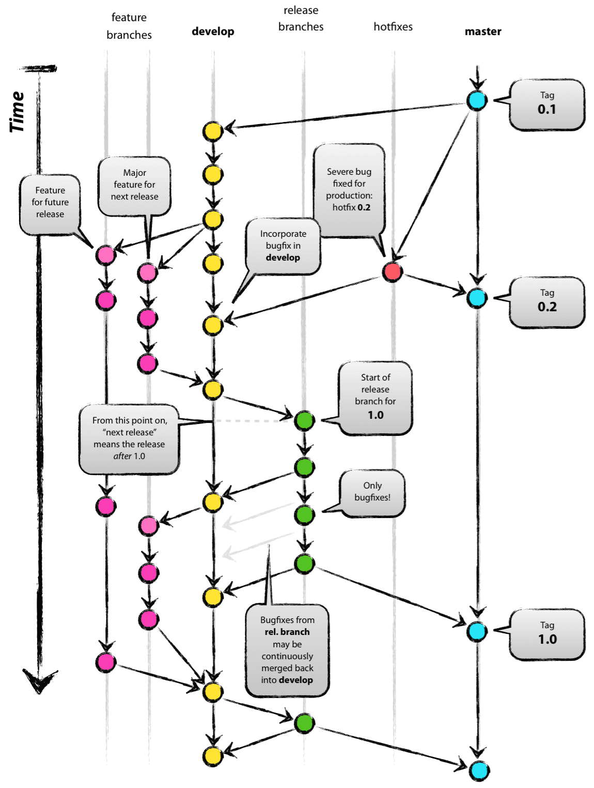

| 브랜치      | 설명                                                                                                                                                       |
|-------------|------------------------------------------------------------------------------------------------------------------------------------------------------------|
| `main`      | 개발이 완료되어 배포할 수 있는 브랜치. 즉, 정식 릴리즈 버전.                                                                                               |
| `develop`   | 다음 버전을 개발하는 브랜치. 기본적으로 작업한 내용은 여기에 반영하게 된다.                                                                                |
| `feature/*` | 보통 각 기능별로 `develop`에서 분기하여 개발을 하는 작업 브랜치. 개발이 완료되면 `develop`로 합쳐지고, 작업 브랜치는 서버에서 삭제된다.                    |
| `hotfix/*`  | `main` 브랜치에서 분기하여 버그를 수정하는 브랜치. `main`과 `develop` 브랜치에 병합되고, 작업 브랜치는 삭제된다.                                           |
| `release/*` | 정식 버전 배포를 준비하는 브랜치. 이 과정에서 생기는 버그 수정은 `develop`으로 합쳐질 수도 있고, 릴리즈가 완료되어 `main` 브랜치로 병합된 후에는 삭제된다. |

기본적으로 모든 작업은 `develop`에서 분기하여 시작하고, `develop`에 병합된다. 새 버전 개발이 완료되면 `main`에 반영된다.

### 새 브랜치 생성

새 브랜치를 생성하기 위해 다음과 같은 방법을 사용한다.

#### Eclipse를 사용하는 방법

1. Perspective 툴바에서 을 선택하여 Git Perspective로 전환한다.
2. `Git Repositories` 창에서 프로젝트 하위 `Branches`를 확장한다.
3. 새 브랜치를 만들 기준이 될 브랜치를 마우스 오른쪽 클릭한 후, 메뉴에서 `Create Branch...`를 선택한다.  
   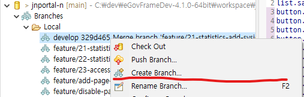
4. `Create Branch` 창에서 새 브랜치 이름을 입력한 후 `Finish` 버튼을 클릭한다.  
   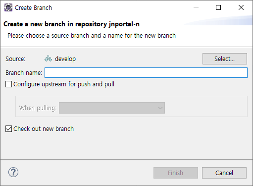


#### 명령줄을 사용하는 방법

1. 프로젝트 경로로 이동한다.
2. `git branch` 명령을 사용하여 새 브랜치를 생성한다.
   ```shell
   git branch 새_브랜치_이름
   ```
3. `git checkout` 명령을 사용하여 새 브랜치로 이동한다.
   ```shell
   git checkout 새_브랜치_이름
   ```

### 다른 브랜치로 이동

작업 중 다른 브랜치로 이동하기 위해 다음과 같은 방법을 사용한다.

#### Eclipse를 사용하는 방법

1. Perspective 툴바에서 을 선택하여 Git Perspective로 전환한다.
2. `Git Repositories` 창에서 프로젝트 하위 `Branches`를 확장한다.
3. `Local` 또는 `Remote` 밑의 이동하고자 하는 브랜치를 더블 클릭한다.
4. 만약 원격 브랜치인 경우, 로컬 브랜치를 생성할 지 물어보는데, 
   `Check out as New Local Branch`를 선택하여 로컬 브랜치가 생성되도록 해야 한다.  
   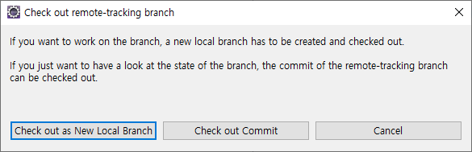
5. 이동한 브랜치의 아이콘에 현재 작업 브랜치라는 뜻의 체크 표시가 생긴다.

#### 명령줄을 사용하는 방법

1. 프로젝트 경로로 이동한다.
2. `git branch` 명령을 사용하여 브랜치 목록을 확인한다.
   ```shell
   git branch
   ```
   목록에서 현재 브랜치는 앞에 * 표시가 붙어 나온다.
3. `git checkout` 명령을 사용하여 다른 브랜치로 이동한다.
   ```shell
   git checkout 다른_브랜치_이름
   ```
   
### 브랜치 이름 변경

로컬 브랜치의 이름을 변경하기 위해 다음 방법을 사용한다.

#### Eclipse를 사용하는 방법

1. Perspective 툴바에서 을 선택하여 Git Perspective로 전환한다.
2. `Git Repositories` 창에서 프로젝트 하위 `Branches`를 확장한다.
3. 이름을 변경할 브랜치를 선택하여 `F2` 키를 누른다.
4. 새 이름을 입력하고 `Rename` 버튼을 클릭한다.  
   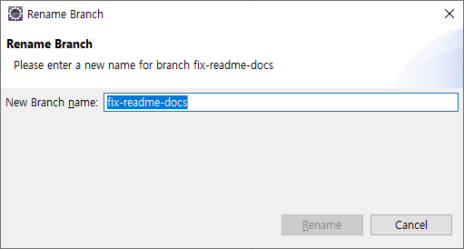

#### 명령줄을 사용하는 방법

1. 프로젝트 경로로 이동한다.
2. `git branch` 명령을 사용하여 브랜치 목록을 확인한다.
   ```shell
   git branch
   ```
   목록에서 현재 브랜치는 앞에 * 표시가 붙어 나온다.
3. `git branch` 명령의 `-m` 옵션을 사용하여 브랜치의 이름을 변경한다.
   ```shell
   git branch -m 이전_브랜치_이름 새_브랜치_이름
   ```

### 브랜치 삭제

필요가 없어진 로컬 브랜치를 삭제하기 위해 다음 방법을 사용한다.

#### Eclipse를 사용하는 방법

1. 우선 현재 작업 브랜치를 지우고자 하는 경우, 먼저 다른 브랜치로 이동한다.
2. 삭제할 브랜치를 선택한 후, `Delete` 키를 누른다. 묻지도 않고 바로 지워버리니 주의.

#### 명령줄을 사용하는 방법

1. 프로젝트 경로로 이동한다.
2. `git branch` 명령을 사용하여 브랜치 목록을 확인한다.
   ```shell
   git branch
   ```
   목록에서 현재 브랜치는 앞에 * 표시가 붙어 나온다.
3. 현재 작업 브랜치를 지우고자 하는 경우, 먼저 다른 브랜치로 이동한다.
4. `git branch` 명령의 `-D` 옵션을 사용하여 브랜치를 삭제한다.
   ```shell
   git branch
   ```
   묻지도 않고 바로 지워버리니 주의.

3\. 소스 코드 업데이트
----------------------

소스 코드를 서버의 최신 버전으로 업데이트하기 위해서는 다음과 같이 한다.

### Eclipse를 사용하는 방법

1. 우선 업데이트받을 브랜치로 이동한다.
2. `Git Repositories` 창에서 프로젝트를 마우스 오른쪽 클릭한 후, `Pull`을 클릭한다.  
   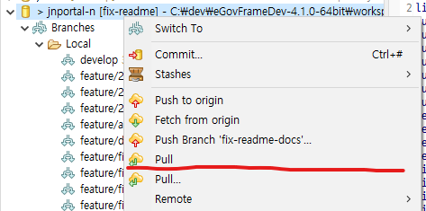
3. 성공적으로 완료되면 업데이트받은 커밋 목록이 표시된다.  
   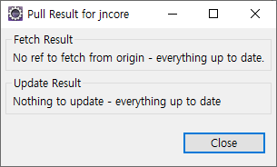

### 명령줄을 사용하는 방법

1. 프로젝트 경로로 이동한다.
2. 업데이트 받을 브랜치로 이동한다.
3. `git pull` 명령을 사용하여 서버의 최신 소스 코드를 업데이트받는다.
   ```shell
   git pull
   ```
4. 성공적으로 완료되면 업데이트 받은 커밋 목록이 표시된다.

4\. 소스 코드 커밋 및 푸시
--------------------------

Git의 경우, 소스 코드를 커밋하면 로컬 레포지토리에 반영되고, 이를 원격 레포지토리로 푸시해야 서버에 반영된다.

### 커밋

변경 내용을 로컬 레포지토리에 반영한다.

#### Eclipse를 사용하는 방법

1. `Project Explorer` 창에서 프로젝트를 마우스 오른쪽 클릭한 후, `Team`-`Commit...`을 선택한다.  
   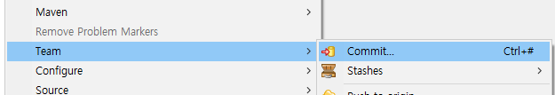
2. `Git Staging` 창의 `Unstaged Changes` 목록에서 커밋할 파일을 선택한 후, 
    버튼을 클릭하여 `Staged Chages` 목록에 추가한다.  
   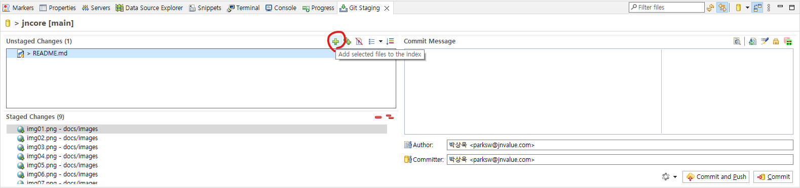
3. `Commit Message` 란에 커밋 메시지를 입력한다.  
   내용이 긴 경우, 첫 줄에 요약을 적고, 두 번 줄바꿈한 후 상세 내용을 적으면, 알아서 첫 줄은 제목으로, 빈 줄 뒤를 본문으로 인식한다.
4. Author, Committer를 설정한다.
   ```
   이름 <이메일>
   ```
5. `Commit` 버튼을 클릭한다.

#### 명령줄을 사용하는 방법

1. 프로젝트 경로로 이동한다.
2. `git status` 명령을 사용하여 추가/수정된 파일 목록을 확인한다.
   ```shell
   git status --porcelain
   ```
   실행 결과에 대한 설명은 [Git 매뉴얼](https://git-scm.com/docs/git-status#_output) 참조
3. 추가할 파일을 `git add` 명령을 사용해 인덱스에 추가하여 스테이지되도록 한다.
   ```shell
   git add 추가할_파일_경로
   ```
4. `git commit` 명령을 사용해 스테이지된 파일을 커밋한다.
   ```shell
   git commit
   ```
5. 명령 실행 과정에서 Git 설치 시 지정한 텍스트 에디터가 표시된다.  
   여기에 커밋 메시지를 작성하고, 저장 후 닫으면 커밋이 완료된다.

### 커밋 수정

아직 서버로 보내지 않은 커밋은 변경 내용을 추가하거나 메시지를 수정할 수 있다.

#### Eclipse를 사용하는 방법

`Git Staging` 창에서  버튼을 눌러 활성화하면 `Commit` 버튼을 누를 때 직전 커밋이 수정된다.

#### 명령줄을 사용하는 방법

`git commit` 명령에 `-a` 옵션을 주면 직전 커밋이 수정된다.

### 푸시

로컬에서 생성한 커밋을 서버로 보내는 것을 푸시라고 한다. 이 과정이 수행되어야 PC에서 개발한 소스를 서버에 반영할 수 있다.

#### Eclipse를 사용하는 방법

1. `Git Staging` 창에서 `Push HEAD...` 버튼을 클릭한다.
2. `Push Branch` 창에서 `Push` 버튼을 클릭하면 서버로 현재 브랜치를 푸시하기 시작한다.
   바로 `Push` 버튼을 누르는 대신 `Preview` 버튼을 클릭하여 푸시할 커밋 목록을 확인할 수 있다.  
   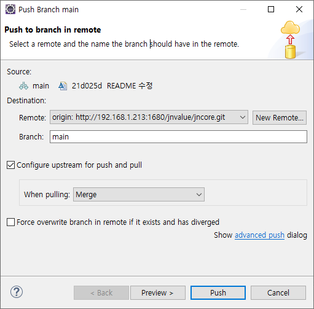
3. 푸시가 완료되면 결과가 팝업으로 표시된다.  
   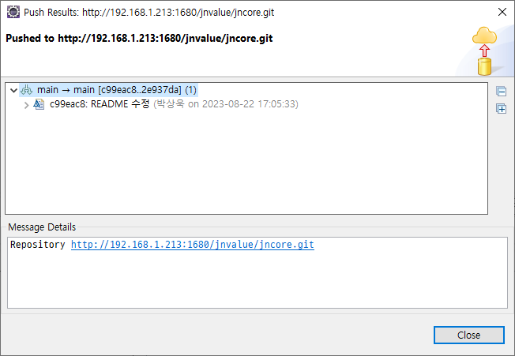

#### 명령줄을 사용하는 방법

1. 프로젝트 경로로 이동한다.
2. `git push` 명령을 사용하여 브랜치를 원격으로 푸시한다.
   ```shell
   git push origin 브랜치_이름
   ```
   `origin`은 서버에 있는 원격 레포지토리를 의미한다.

5\. Merge Request 생성
----------------------

만약 대상 브랜치에 커밋, 머지, 푸시할 권한이 없다면, merge request를 생성하여 다른 사람이 처리해 주도록 요청해야 한다.

1. 회사 GitLab에 로그인하고, 프로젝트 페이지로 이동한다.
2. 화면 좌측 사이드바에서 `Merge requests`를 선택한다.
   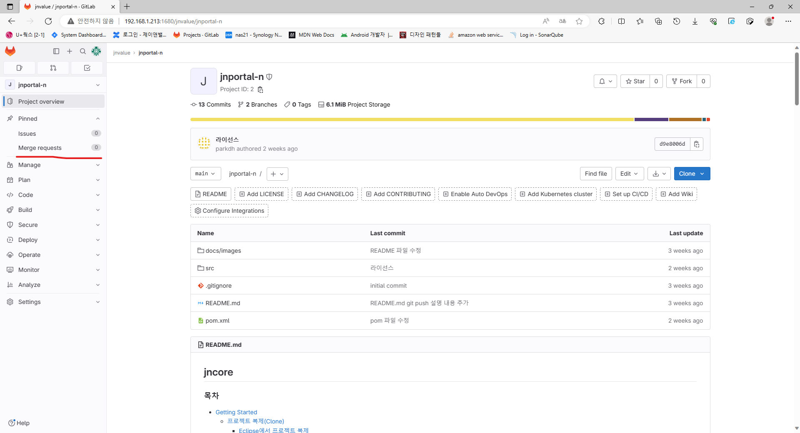
3. `Merge Request` 목록 우상단의 `New merge request` 버튼을 클릭한다.  
   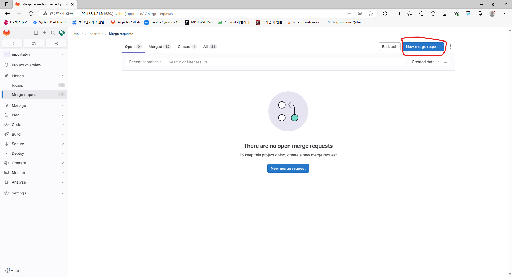
4. `Source branch`는 본인이 작업한 작업 브랜치를, `Target branch`는 본인이 
   작업한 내용이 합쳐질 브랜치(주로 `develop`)를 선택하고, 
   `Compare branches and continue` 버튼을 클릭한다.
   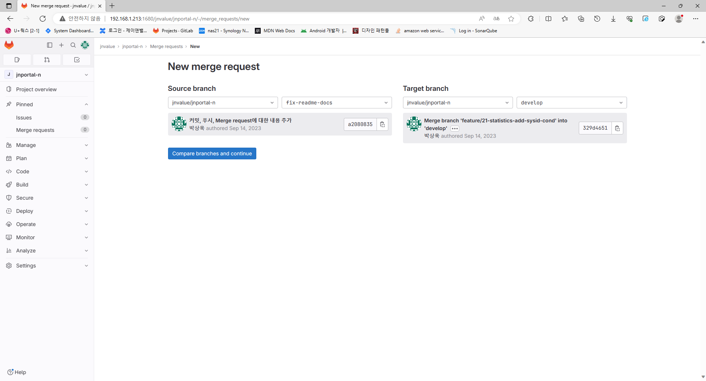
5. Merge request의 제목, 내용을 입력하고, `Create merge request` 버튼을 클릭한다.
   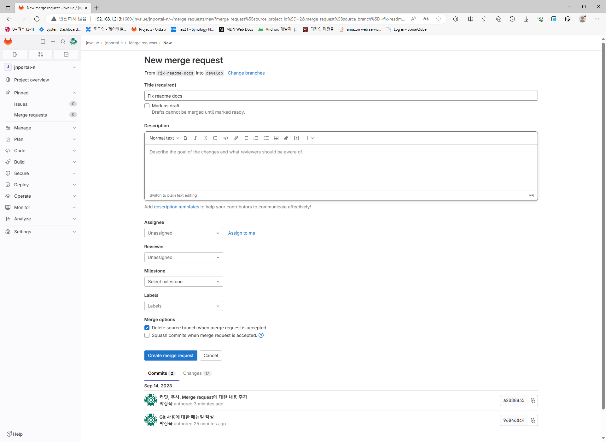
6. 생성된 merge request는 다른 사람이 검토한 후, 대상 브랜치로 머지하거나, 머지 하지 않고 그냥 닫을 수 있다.

6\. Maven이 라이브러리를 불러오지 못할 때
-----------------------------------------

`%USERPROFILE%\.m2\`에 (주로 `C:\Users\(사용자)\.m2\`) [링크](settings.xml)의 `settings.xml` 파일을 다운로드하고,
 `repository` 폴더를 지운 후 재시도한다.
